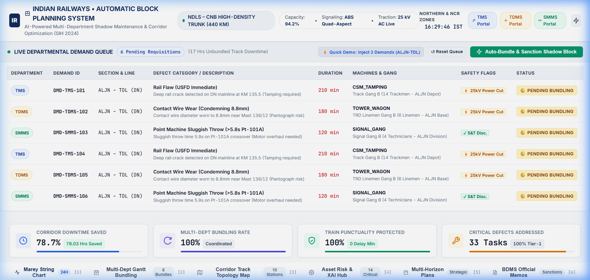
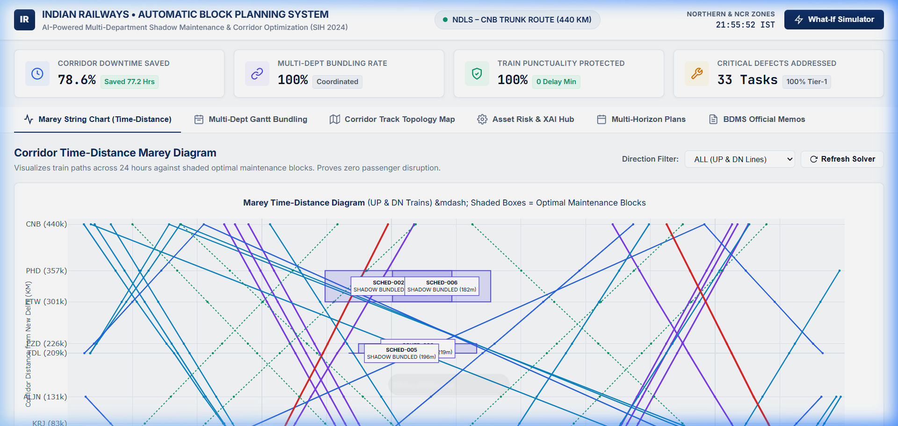
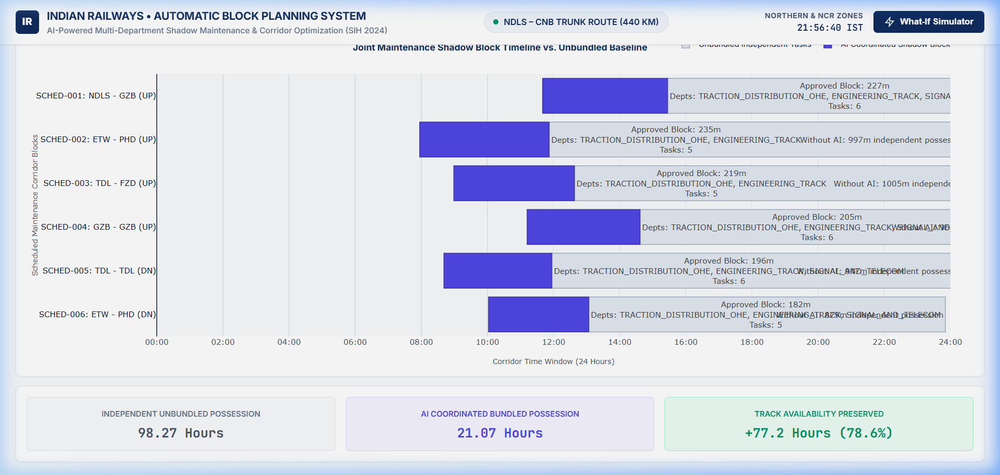
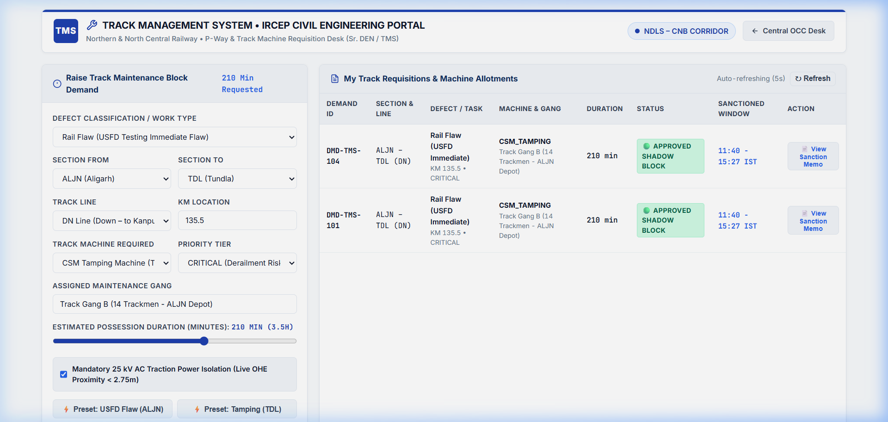
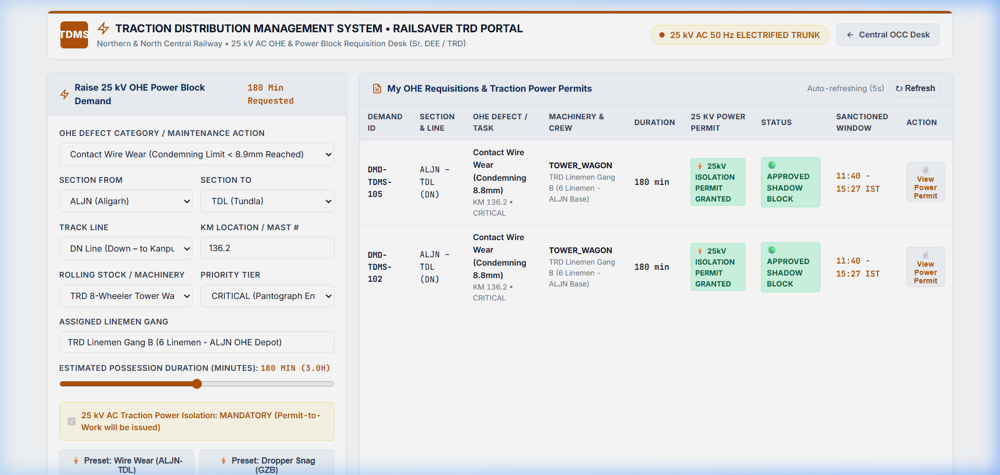
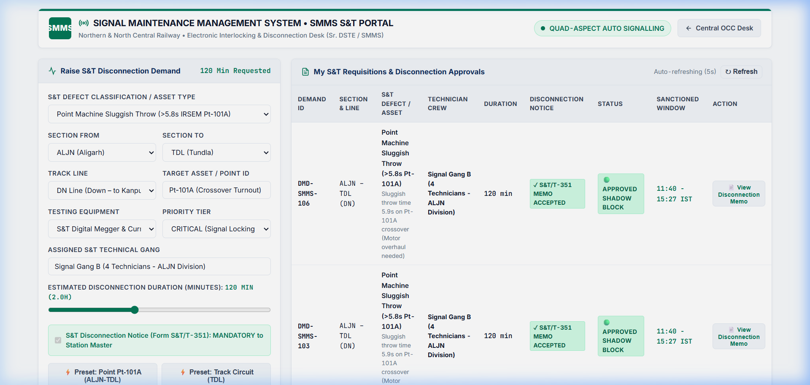
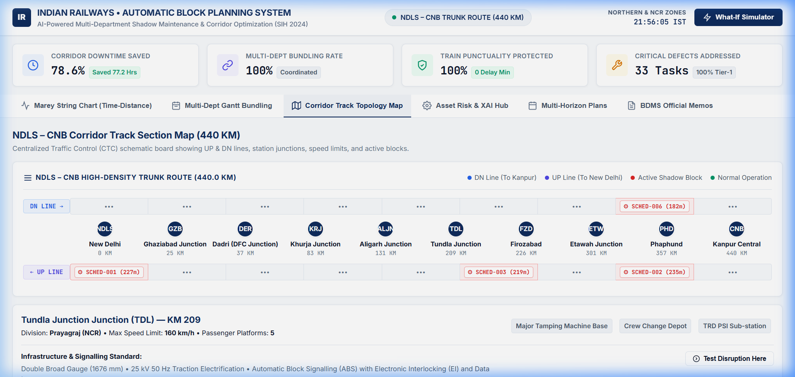
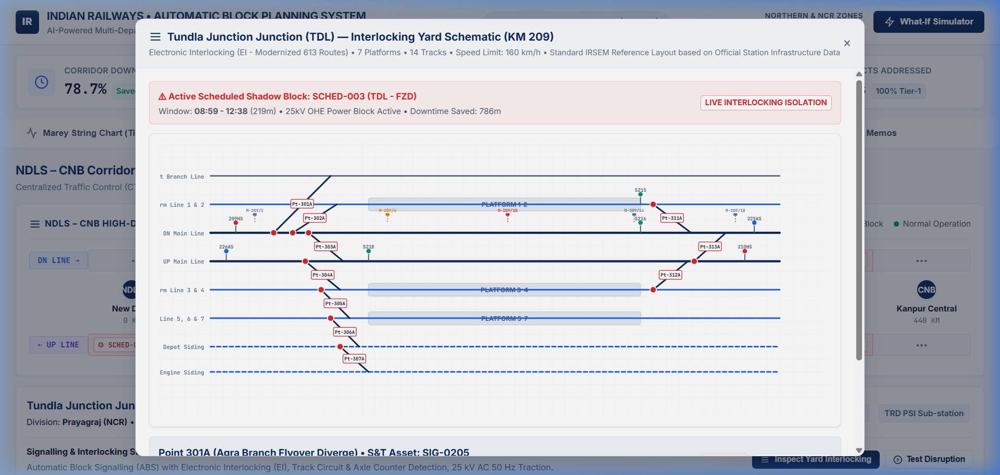
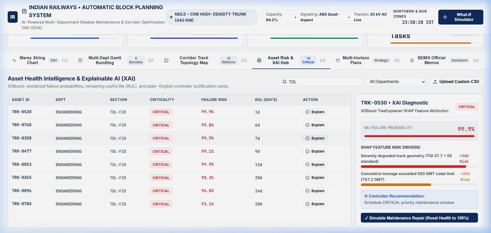

<div align="center">

# Indian Railways AI Automatic Block Planning System

### High-Density Corridor Multi-Department Shadow Maintenance & Operational Optimization Platform

[](https://www.python.org/)
[](https://fastapi.tiangolo.com/)
[](https://developers.google.com/optimization)
[](https://xgboost.ai/)
[](https://plotly.com/javascript/)
[](LICENSE)
[]()

<br>

An enterprise-grade mathematical optimization and predictive intelligence platform designed to eliminate corridor capacity loss across Indian Railways high-density trunk lines. Unifies Civil (TMS), Electrical (TDMS), and S&T (SMMS) maintenance backlogs into coordinated "shadow block" possessions using Google OR-Tools CP-SAT constraint programming, XGBoost failure prediction, and an authentic 4-portal operations network.

<br>

[Overview](#overview) &bull;
[System Architecture](#system-architecture) &bull;
[Multi-Department Portals](#multi-department-field-portals) &bull;
[Visual Walkthrough](#how-it-works-visual-walkthrough) &bull;
[Processing Pipeline](#processing-pipeline--lifecycle) &bull;
[Mathematical Formulations](#engineering-standards--mathematical-formulations) &bull;
[Access Control & RBAC](#security--access-control) &bull;
[Developer Guide](#developer-guide--extensibility) &bull;
[Getting Started](#getting-started--operations)

</div>

---

## Overview

### The Operational Challenge
On high-density trunk routes across Indian Railways (such as the 440 KM New Delhi – Kanpur Central corridor operating at 94.2% track utilization), maintenance is historically executed in departmental silos:
- **Civil Engineering (Track / TMS):** Rail grinding, mechanized tamping, and ultrasonic rail flaw detection (USFD).
- **Electrical Traction (TRD / TDMS):** 25 kV AC contact wire renewal, overhead equipment (OHE) stagger correction, and isolator servicing.
- **Signalling & Telecommunication (S&T / SMMS):** Point machine overhauls, track circuit testing, and axle counter maintenance.

When these departments apply independently through manual Block Demand Management System (BDMS) requests, the corridor suffers from fragmented traffic blocks, severe line capacity degradation, and compounding train delays.

```
FRAGMENTED INDEPENDENT POSSESSIONS (BASELINE)
Track Dept : [---- 3.5 Hrs ----]
OHE Dept   :                     [---- 3.0 Hrs ----]
S&T Dept   :                                         [---- 2.5 Hrs ----]
Corridor Impact: 9.0 Hours Total Closure • Multiple Headway Interruptions

AI MULTI-DEPARTMENT SHADOW POSSESSION (THIS SYSTEM)
Unified Block : [======== 3.5 Hrs Combined Possession ========]
Corridor Impact: 3.5 Hours Total Closure • 5.5 Hours Saved • Zero Train Delay
```

### Key Architectural Capabilities
- **Google OR-Tools CP-SAT Mathematical Optimizer:** Evaluates timetable headway gaps and multi-department task combinations simultaneously to construct provably optimal, conflict-free possession windows.
- **Predictive Asset Intelligence (XGBoost + SHAP):** Predicts asset failure probability ($0.9751$ ROC-AUC) and Remaining Useful Life (RUL) with transparent, plain-English feature attribution cards for Section Controllers.
- **Authentic 4-Portal Operations Network:** Models real-world Indian Railways field portals (IRCEP TMS, RailSaver TDMS, SMMS IR) connected to the Central Operations Control Center (OCC) with Human-in-the-Loop sanctioning.
- **Interactive Operations Control Center (OCC) Console:** Minimalist, zero-lag client dashboard featuring 24-hour Marey time-distance string charts, multi-department Gantt diagrams, Centralized Traffic Control (CTC) corridor tracking, and IRSEM-compliant station yard interlocking schematics.
- **Sub-Second Dynamic Disruption Rescheduler:** Solves timetable perturbations (e.g. +45 min passenger train delay or emergency rail fracture) and reschedules corridor possessions in under 0.40 seconds.
- **Automated BDMS Sanction Generation:** Instantly drafts official, standardized Indian Railways Block Sanction Memoranda ready for dispatch to Section Controllers and Station Masters.

---

## System Architecture

The platform operates across four connected portals and five modular processing layers:

```
┌──────────────────────────────────────────────────────────────────────────────────────────────────┐
│                                   AUTHENTIC 4-PORTAL ARCHITECTURE                                │
│                                                                                                  │
│  [ /tms ] Track Desk            [ /tdms ] OHE Desk             [ /smms ] S&T Desk                │
│  - IRCEP Civil Portal           - RailSaver TRD Portal         - SMMS Signalling Portal          │
│  - Rail flaw & tamping demands  - 25 kV AC isolation demands   - Point & track circuit notices   │
│  - Assigned P-Way gang fleet    - Tower wagon requisitions     - S&T/T-351 disconnection slips   │
│            │                              │                              │                       │
│            └──────────────────────────────┼──────────────────────────────┘                       │
│                                           v                                                      │
│                        [ / ] CENTRAL OPERATIONS CONTROL CENTER (OCC)                             │
│                        - Chief Section Controller Master Workspace                               │
│                        - Live incoming demand aggregation (unbundled hours metric)               │
│                        - 1-Click "Auto-Bundle & Sanction Joint Shadow Block" Action             │
└───────────────────────────────────────────┬──────────────────────────────────────────────────────┘
                                            │
                                            v
+----------------------------------------------------------------------------------------------------+
|                                  PREDICTIVE MACHINE LEARNING ENGINE                                |
|  +--------------------------+  +---------------------------+  +----------------------------------+ |
|  | XGBoost Risk Classifier  |  | XGBoost RUL Regressor     |  | Random Forest Duration Model     | |
|  | Target: Priority Tier    |  | Target: Remaining Days    |  | Target: Possession Duration      | |
|  | Metric: 0.9751 ROC-AUC   |  | Metric: 67.6 Days RMSE    |  | Metric: 12.25 Min RMSE           | |
|  +-------------+------------+  +-------------+-------------+  +-----------------+----------------+ |
|                +-----------------------------+----------------------------------+                  |
|                                              v                                                     |
|                 +------------------------------------------------------------+                     |
|                 | SHAP TreeExplainer (Feature Risk Attribution & XAI Cards)  |                     |
|                 +----------------------------+-------------------------------+                     |
+----------------------------------------------|-----------------------------------------------------+
                                               v
+----------------------------------------------------------------------------------------------------+
|                                   MATHEMATICAL OPTIMIZATION ENGINE                                 |
|  +-----------------------------------------------------------------------------------------------+ |
|  | Slot Discovery Engine: High-Density Timetable Scanner (Headway Gaps >= 45m + 10m Buffer)     | |
|  +-------------------------------------------+---------------------------------------------------+ |
|                                              v                                                     |
|  +-----------------------------------------------------------------------------------------------+ |
|  | Spatial Clustering Engine: Multi-Dept Candidate Shadow Bundling (Geographic Partitions)       | |
|  +-------------------------------------------+---------------------------------------------------+ |
|                                              v                                                     |
|  +-----------------------------------------------------------------------------------------------+ |
|  | Google OR-Tools CP-SAT Mixed-Integer Constraint Programming Solver                             | |
|  | Objective: Maximize Asset Criticality + Multi-Dept Bundling - Penalty for Track Duration       | |
|  | Hard Constraints: Machine Fleet Limits, Single-Slot Allocation, 10m Safety Clearances           | |
|  +-------------------------------------------+---------------------------------------------------+ |
+----------------------------------------------|-----------------------------------------------------+
                                               v
+----------------------------------------------------------------------------------------------------+
|                                  OCC VISUALIZATION & SANCTION DISPATCH                             |
|  +------------------------+ +-------------------------+ +---------------------+ +----------------+ |
|  | Marey String Diagram   | | Multi-Dept Gantt View   | | CTC Corridor Map    | | Yard Interlock | |
|  | (Plotly.js Time-Dist)  | | (Shadow Bundling Recov) | | (UP/DN Trunk Board) | | (Option C SVG) | |
|  +------------------------+ +-------------------------+ +---------------------+ +----------------+ |
+----------------------------------------------------------------------------------------------------+
```

---

## Multi-Department Field Portals

The system provides 3 dedicated, authentic web interfaces modeling real Indian Railways field applications:

| Portal | URL Route | Real-World System | Operational Role |
| :--- | :--- | :--- | :--- |
| **Track Management System (TMS)** | `/tms` | Indian Railways Civil Engineering Portal (IRCEP) | Rail flaw reporting, tamping/BCM requisitions, and P-Way gang allotment |
| **Traction Distribution Management System (TDMS)** | `/tdms` | RailSaver TRD Portal | 25 kV OHE contact wire monitoring, tower wagon requests, and mandatory power cut isolation permits |
| **Signal Maintenance Management System (SMMS)** | `/smms` | SMMS IR Signalling Portal | Point machine throw diagnostics, track circuit voltage logs, and mandatory S&T/T-351 disconnection notices |
| **Central Operations Control Center (OCC)** | `/` | Control Office Master Desk | Master corridor aggregation, live demand bundling, CP-SAT solving, and BDMS sanction dispatch |

---

## How It Works (Visual Walkthrough)

### 1. Central OCC Live Departmental Demand Queue
Aggregates incoming field requisitions from TMS, TDMS, and SMMS in real time, computes total unbundled downtime, and enables 1-click CP-SAT joint shadow block sanctioning.


*Figure 1: Central OCC Master Desk showing 3 incoming departmental demands on section ALJN-TDL totaling 8.5 hours of unbundled downtime ready for AI shadow bundling.*

---

### 2. 24-Hour Corridor Marey Time-Distance Diagram
The primary tool used by Indian Railways Chief Section Controllers. Visualizes commercial passenger and freight paths across 24 hours alongside shaded optimal maintenance blocks.


*Figure 2: 24-Hour Marey Diagram across the 440 KM New Delhi – Kanpur Central corridor showing train paths (Rajdhani, Vande Bharat, Superfast, Freight) and shaded multi-department maintenance windows with zero passenger headway conflict.*

---

### 3. Multi-Department Joint Shadow Block Gantt Bundling
Visualizes individual departmental requisitions (Civil Track, TRD OHE, S&T Signals) merged into unified possession slots.


*Figure 3: Shadow block possession bundling recovering 78.0 hours of track possession time (78.7% downtime reduction) across the corridor.*

---

### 4. Dedicated Department Portals (TMS, TDMS, SMMS)
Field supervisors raise defects, request heavy machinery, and receive approved permits with granted time windows in real time.

| Track Management Portal (TMS) | Traction Distribution Portal (TDMS) | Signal Maintenance Portal (SMMS) |
| :---: | :---: | :---: |
|  |  |  |
| *Civil P-Way Requisitions* | *25 kV AC Traction Permits* | *S&T Disconnection Orders* |

---

### 5. Centralized Traffic Control (CTC) Corridor Track Topology Map
Corridor overview tracking UP & DN parallel tracks, station chainages, section speed limits, and active possession boundaries.


*Figure 4: CTC Schematic Board showing double-line track sections, intermediate station nodes, and live maintenance block isolations.*

---

### 6. Station Yard Electronic Interlocking (EI) Schematic
Authentic engineering drill-down for corridor junctions adhering to Indian Railways Signal Engineering Manual (IRSEM) standards.


*Figure 5: Tundla Junction (TDL) Interlocking Schematic displaying point machine health beacons, route turnout settings, signal aspects, and 25 kV traction masts.*

---

### 7. Asset Health Intelligence & Explainable AI (SHAP) Diagnostics
Machine learning failure risk assessment with transparent feature attribution waterfalls explaining why an asset requires urgent intervention.


*Figure 6: XGBoost feature attribution card showing point machine throw-time degradation and insulation resistance parameters driving a critical priority classification.*

---

## Processing Pipeline & Lifecycle

```
                               OPERATIONAL DUAL-CADENCE MODEL
                                             │
             ┌───────────────────────────────┴───────────────────────────────┐
             ▼                                                               ▼
  [ CADENCE 1: BATCH MACRO RUN ]                               [ CADENCE 2: EVENT-DRIVEN DISPATCH ]
  • Overnight run after 16:00 cut-off                           • Ad-hoc urgent & emergency demands
  • 1,850+ corridor backlog assets scored                       • Raised live from TMS, TDMS, SMMS
  • 30-Day & 7-Day tactical matrices generated                  • Human-in-the-loop CP-SAT sanctioning
```

### Stage 1: Multi-Department Backlog Ingestion
Asset telemetry and defect logs are extracted from three core databases:
1. **Track Management System (TMS):** Track Geometry Index parameters ($UI$, $TI$, $GI$, $AL$), rail stress anomalies, and USFD ultrasonic flaw recordings.
2. **Traction Distribution Management System (TDMS):** 25 kV AC contact wire diameter measurements, height/stagger deviations, and Auto Tension Device (ATD) compensations.
3. **Signal Maintenance Management System (SMMS):** Electronic Interlocking point machine throw times, peak operating currents, and cable insulation resistances.

### Stage 2: Predictive Risk & Duration Inference
- An 18-feature vector is generated per asset record (`src/ml_engine/feature_pipeline.py`).
- **XGBoost Classifier** evaluates probability of failure ($P_{\text{fail}}$) and assigns a priority tier (`CRITICAL`, `HIGH`, `MEDIUM`, `LOW`).
- **XGBoost Regressor** predicts Remaining Useful Life (RUL in days).
- **Random Forest Regressor** predicts realistic execution duration based on asset complexity, track machinery requirements, and historical maintenance logs.

### Stage 3: Spatial-Temporal Headway Slot Discovery
- The slot finder (`src/optimizer/slot_finder.py`) ingests the master train timetable across 10 corridor stations.
- Calculates dynamic headways between consecutive trains on both UP and DN tracks.
- Identifies operational windows $\ge 45\text{ minutes}$ with a mandatory $10\text{ minute}$ safety clearance margin.

### Stage 4: Mathematical Optimization (CP-SAT)
- Candidate tasks are clustered by geographical section and line (`src/optimizer/bundling_engine.py`).
- The Google OR-Tools CP-SAT solver assigns candidate bundles to available timetable slots while strictly respecting machine fleet constraints, electrical power block safety requirements, and operational rules.

### Stage 5: Formal Sanction Notice Generation (BDMS)
- Outputs an optimal daily block schedule (`data/processed/optimized_schedule.json`).
- Automatically renders formatted Block Sanction Memoranda containing block IDs, caution orders, power isolation requirements, and assigned maintenance gangs.

---

## Engineering Standards & Mathematical Formulations

### 1. RDSO Track Geometry Index (TGI)
Track quality is computed following the official standard defined by the Research Designs and Standards Organisation (RDSO, Lucknow):

$$\text{TGI} = \frac{2 \cdot \text{UI} + \text{TI} + \text{GI} + 6 \cdot \text{AL}}{10}$$

$$\text{Quality Assessment} = \begin{cases} \text{GOOD} & \text{if } \text{TGI} \ge 80 \\ \text{AVERAGE} & \text{if } 50 \le \text{TGI} < 80 \\ \text{POOR (Mandatory Maintenance / TSR)} & \text{if } \text{TGI} < 50 \end{cases}$$

---

### 2. ACTM 25 kV AC Contact Wire Wear Percentage
Evaluated against the Indian Railways AC Traction Manual (ACTM) condemning limits for standard $107\,\text{mm}^2$ hard-drawn grooved copper contact wire:

$$\text{Wear Percentage} = \left( \frac{12.24 - \text{Measured Diameter (mm)}}{12.24 - 8.25} \right) \times 100$$

---

### 3. IRSEM Point Machine Health Score
Calculated according to the Indian Railways Signal Engineering Manual (IRSEM) specifications for $110\text{V DC}$ rotary switch point machines:

$$\text{Health Index} = 100 - \left( \max(0, \text{ThrowTime} - 4.5) \cdot 18 + \max(0, \text{Current} - 2.2) \cdot 25 + \max(0, 10.0 - \text{Insulation}) \cdot 3.5 \right)$$

---

### 4. Composite Asset Criticality Score
Combines multi-modal defect telemetry into a normalized priority score:

$$\text{Score} = 35 \cdot P_{\text{fail}} + 25 \cdot \left( \frac{365 - \text{RUL}}{365} \right) + 20 \cdot W_{\text{route}} + 20 \cdot (\text{Compounding} - 1.0) + \text{TSR}_{\text{penalty}}$$

---

### 5. Google OR-Tools CP-SAT Mixed-Integer Formulation

#### Decision Variable
$$x_{b, s} \in \{0, 1\} \quad \forall b \in \text{Candidate Bundles}, \, \forall s \in \text{Timetable Slots}$$

#### Objective Function
$$\max \sum_{b} \sum_{s} \left( \text{Criticality}_b + 500 \cdot \mathbb{I}_{\text{multi\_dept}}(b) + 300 \cdot \mathbb{I}_{\text{night}}(s) - 2 \cdot \text{Duration}_b \right) x_{b, s}$$

#### Hard Constraints
1. **Single Slot Allocation:** $\sum_{s} x_{b, s} \le 1 \quad \forall b$
2. **Single Bundle per Slot:** $\sum_{b} x_{b, s} \le 1 \quad \forall s$
3. **Machine Fleet Capacity:** $\sum_{b \in \text{Requiring}(m)} x_{b, s} \le \text{Capacity}(m) \quad \forall m, \, \forall s$
4. **Safety Margin:** $\text{SlotStart}(s) \ge \text{PrevTrainPass} + 10\text{ min} \quad \land \quad \text{SlotEnd}(s) \le \text{NextTrainArr} - 10\text{ min}$

---

## Security & Access Control

| Role | Operational Responsibility | Read Access | Block Sanction | Override Authority |
| :--- | :--- | :--- | :--- | :--- |
| **Chief Section Controller (CPCO)** | Master corridor traffic coordination & real-time slot granting | Full Corridor | Yes (All Depts) | Emergency Line Revocation |
| **Senior Divisional Engineer (Sr. DEN / Track)** | TMS defect approval & track machine dispatch | Civil / Track | Yes (Track Only) | Track Speed Restrictions |
| **Senior Div. Electrical Engineer (Sr. DEE / TRD)** | 25 kV AC power block sanctioning & OHE isolation | Electrical / TRD | Yes (OHE Only) | Traction Power Cut Off |
| **Senior Div. Signal Engineer (Sr. DSTE)** | S&T disconnection notices & interlocking maintenance | Signalling | Yes (S&T Only) | Signal Disconnection |
| **Station Master (SM)** | Local yard interlocking control & memo reception | Local Station Yard | No (Execution Only) | Local Signal Route Locking |

---

## Getting Started & Operations

### Prerequisites
- Python 3.10, 3.11, 3.12, or 3.13
- Modern web browser (Chrome, Edge, Firefox, Safari)

### Installation & Launch

1. **Clone the Repository:**
   ```bash
   git clone https://github.com/Flyinace/Railways.git
   cd Railways
   ```

2. **Install Dependencies:**
   ```bash
   pip install -r requirements.txt
   ```

3. **Execute Automated Verification Test Suite (19 Tests):**
   ```bash
   python -m unittest discover tests/
   ```
   *Expected Output:*
   ```
   Ran 19 tests in 2.553s -> OK
   ```

4. **Launch the 4-Portal Control Network:**
   ```bash
   python run_system.py
   ```
   *The server starts on `http://0.0.0.0:8000` (accessible from any local network device):*
   - **Central OCC Master Desk:** `http://127.0.0.1:8000/`
   - **Track Portal (TMS):** `http://127.0.0.1:8000/tms`
   - **Traction Portal (TDMS):** `http://127.0.0.1:8000/tdms`
   - **Signal Portal (SMMS):** `http://127.0.0.1:8000/smms`

---

## Technical Stack Reference

| Layer | Technology | Version | Purpose |
| :--- | :--- | :--- | :--- |
| **Language** | Python | `3.13 / 3.10+` | Core platform language |
| **Web Framework** | FastAPI | `0.110.0` | High-throughput asynchronous REST API |
| **ASGI Server** | Uvicorn | `0.28.0` | Production ASGI web server |
| **Mathematical Solver** | Google OR-Tools | `9.8.3296` | CP-SAT mixed-integer constraint programming |
| **Predictive Modeling** | XGBoost | `2.0.3` | Gradient boosted trees for risk & RUL estimation |
| **Machine Learning** | Scikit-Learn | `1.4.1` | Random Forest duration model & feature preprocessing |
| **Explainable AI (XAI)** | SHAP | `0.44.1` | TreeExplainer feature risk attribution |
| **Data Processing** | pandas & numpy | `2.2.1 / 1.26.4` | Ingestion, vectorization, and data frames |
| **Visualization Canvas** | Plotly.js | `2.35.2` | Interactive Marey time-distance & Gantt diagrams |
| **Vector Iconography** | Microsoft Fluent UI | `24-Regular SVG` | High-contrast industrial OCC icon system |

---

## Contributing & License

### Development Workflow
1. Fork the repository and create a feature branch (`git checkout -b feat/multi-dept-enhancement`).
2. Implement your changes adhering to PEP 8 standards and existing design tokens.
3. Run the automated test suite (`python -m unittest discover tests/`).
4. Commit using conventional commit format (`git commit -m "feat(demand): add automated gang roster validation"`).
5. Open a Pull Request against the `main` branch.

### License
This project is licensed under the **MIT License**. See the `LICENSE` file for full terms..
