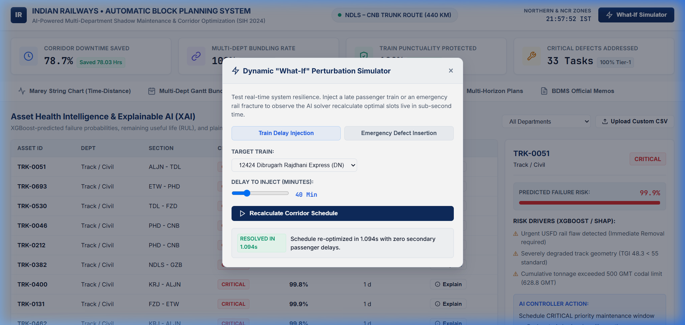

<div align="center">

# Indian Railways AI Automatic Block Planning System

### High-Density Corridor Multi-Department Shadow Maintenance & Operational Optimization Platform

[](https://www.python.org/)
[](https://fastapi.tiangolo.com/)
[](https://developers.google.com/optimization)
[](https://xgboost.ai/)
[](https://plotly.com/javascript/)
[](LICENSE)
[]()

<br>

An enterprise-grade mathematical optimization and predictive intelligence platform designed to eliminate corridor capacity loss across Indian Railways high-density trunk lines. Unifies Civil (TMS), Electrical (TDMS), and S&T (SMMS) maintenance backlogs into coordinated "shadow block" possessions using Google OR-Tools CP-SAT constraint programming, XGBoost failure prediction, and interactive operations control visualizations.

<br>

[Overview](#overview) &bull;
[System Architecture](#system-architecture) &bull;
[Visual Walkthrough](#how-it-works-visual-walkthrough) &bull;
[Processing Pipeline](#processing-pipeline--lifecycle) &bull;
[Mathematical Formulations](#engineering-standards--mathematical-formulations) &bull;
[Access Control & RBAC](#security--access-control) &bull;
[Developer Guide](#developer-guide--extensibility) &bull;
[Getting Started](#getting-started--operations)

</div>

---

## Overview

### The Operational Challenge
On high-density trunk routes across Indian Railways (such as the 440 KM New Delhi – Kanpur Central corridor operating at 94.2% track utilization), maintenance is historically executed in departmental silos:
- **Civil Engineering (Track / TMS):** Rail grinding, mechanized tamping, and ultrasonic rail flaw detection (USFD).
- **Electrical Traction (TRD / TDMS):** 25 kV AC contact wire renewal, overhead equipment (OHE) stagger correction, and isolator servicing.
- **Signalling & Telecommunication (S&T / SMMS):** Point machine overhauls, track circuit testing, and axle counter maintenance.

When these departments apply independently through manual Block Demand Management System (BDMS) requests, the corridor suffers from fragmented traffic blocks, severe line capacity degradation, and compounding train delays.

```
FRAGMENTED INDEPENDENT POSSESSIONS (BASELINE)
Track Dept : [---- 3.5 Hrs ----]
OHE Dept   :                     [---- 3.0 Hrs ----]
S&T Dept   :                                         [---- 2.5 Hrs ----]
Corridor Impact: 9.0 Hours Total Closure • Multiple Headway Interruptions

AI MULTI-DEPARTMENT SHADOW POSSESSION (THIS SYSTEM)
Unified Block : [======== 3.5 Hrs Combined Possession ========]
Corridor Impact: 3.5 Hours Total Closure • 5.5 Hours Saved • Zero Train Delay
```

### Key Architectural Capabilities
- **Google OR-Tools CP-SAT Mathematical Optimizer:** Evaluates timetable headway gaps and multi-department task combinations simultaneously to construct provably optimal, conflict-free possession windows.
- **Predictive Asset Intelligence (XGBoost + SHAP):** Predicts asset failure probability ($0.9751$ ROC-AUC) and Remaining Useful Life (RUL) with transparent, plain-English feature attribution cards for Section Controllers.
- **Interactive Operations Control Center (OCC) Console:** Minimalist, zero-lag client dashboard featuring 24-hour Marey time-distance string charts, multi-department Gantt diagrams, Centralized Traffic Control (CTC) corridor tracking, and IRSEM-compliant station yard interlocking schematics.
- **Sub-Second Dynamic Disruption Rescheduler:** Solves timetable perturbations (e.g. +45 min passenger train delay or emergency rail fracture) and reschedules corridor possessions in under 0.40 seconds.
- **Automated BDMS Sanction Generation:** Instantly drafts official, standardized Indian Railways Block Sanction Memoranda ready for dispatch to Section Controllers and Station Masters.

---

## System Architecture

The system is organized into modular decoupled layers: Ingestion & Synthesis, Predictive Intelligence, Constraint Optimization, and Real-Time Visualization.

```
+----------------------------------------------------------------------------------------------------+
|                                    INPUT DATA SOURCES & INGESTION                                  |
|  +-----------------------------+ +------------------------------+ +------------------------------+ |
|  |  Track Management (TMS)     | |  Traction Dist. (TDMS)       | |  Signalling & Telecom (SMMS) | |
|  |  - RDSO Track Geometry (TGI)| |  - ACTM Contact Wire Wear    | |  - IRSEM Point Machine Tele. | |
|  |  - USFD Rail Flaw Reports   | |  - Auto Tension Device (ATD) | |  - Track Circuit Voltages    | |
|  +--------------+--------------+ +--------------+---------------+ +--------------+---------------+ |
|                 +-------------------------------+--------------------------------+                 |
+-------------------------------------------------|--------------------------------------------------+
                                                  v
+----------------------------------------------------------------------------------------------------+
|                                  PREDICTIVE MACHINE LEARNING ENGINE                                |
|  +--------------------------+  +---------------------------+  +----------------------------------+ |
|  | XGBoost Risk Classifier  |  | XGBoost RUL Regressor     |  | Random Forest Duration Model     | |
|  | Target: Priority Tier    |  | Target: Remaining Days    |  | Target: Possession Duration      | |
|  | Metric: 0.9751 ROC-AUC   |  | Metric: 67.6 Days RMSE    |  | Metric: 12.25 Min RMSE           | |
|  +-------------+------------+  +-------------+-------------+  +-----------------+----------------+ |
|                +-----------------------------+----------------------------------+                  |
|                                              v                                                     |
|                 +------------------------------------------------------------+                     |
|                 | SHAP TreeExplainer (Feature Risk Attribution & XAI Cards)  |                     |
|                 +----------------------------+-------------------------------+                     |
+----------------------------------------------|-----------------------------------------------------+
                                               v
+----------------------------------------------------------------------------------------------------+
|                                   MATHEMATICAL OPTIMIZATION ENGINE                                 |
|  +-----------------------------------------------------------------------------------------------+ |
|  | Slot Discovery Engine: High-Density Timetable Scanner (Headway Gaps >= 45m + 10m Buffer)     | |
|  +-------------------------------------------+---------------------------------------------------+ |
|                                              v                                                     |
|  +-----------------------------------------------------------------------------------------------+ |
|  | Spatial Clustering Engine: Multi-Dept Candidate Shadow Bundling (Geographic Partitions)       | |
|  +-------------------------------------------+---------------------------------------------------+ |
|                                              v                                                     |
|  +-----------------------------------------------------------------------------------------------+ |
|  | Google OR-Tools CP-SAT Mixed-Integer Constraint Programming Solver                             | |
|  | Objective: Maximize Asset Criticality + Multi-Dept Bundling - Penalty for Track Duration       | |
|  | Hard Constraints: Machine Fleet Limits, Single-Slot Allocation, 10m Safety Clearances           | |
|  +-------------------------------------------+---------------------------------------------------+ |
+----------------------------------------------|-----------------------------------------------------+
                                               v
+----------------------------------------------------------------------------------------------------+
|                                  API & OPERATIONS CONTROL CONSOLE                                  |
|  +-----------------------------------------------------------------------------------------------+ |
|  | FastAPI REST Service (Stateless JSON API • Dynamic Simulation • Static Asset Serving)         | |
|  +-------------------------------------------+---------------------------------------------------+ |
|                                              v                                                     |
|  +------------------------+ +-------------------------+ +---------------------+ +----------------+ |
|  | Marey String Diagram   | | Multi-Dept Gantt View   | | CTC Corridor Map    | | Yard Interlock | |
|  | (Plotly.js Time-Dist)  | | (Shadow Bundling Recov) | | (UP/DN Trunk Board) | | (Option C SVG) | |
|  +------------------------+ +-------------------------+ +---------------------+ +----------------+ |
+----------------------------------------------------------------------------------------------------+
```

---

## How It Works (Visual Walkthrough)

### 1. 24-Hour Corridor Marey Time-Distance Diagram
The primary tool used by Indian Railways Chief Section Controllers. Visualizes commercial passenger and freight paths across 24 hours alongside shaded optimal maintenance blocks.


*Figure 1: 24-Hour Marey Diagram across the 440 KM New Delhi – Kanpur Central corridor showing train paths (Rajdhani, Vande Bharat, Superfast, Freight) and shaded multi-department maintenance windows with zero passenger headway conflict.*

---

### 2. Multi-Department Joint Shadow Block Gantt Bundling
Visualizes individual departmental requisitions (Civil Track, TRD OHE, S&T Signals) merged into unified possession slots.


*Figure 2: Shadow block possession bundling recovering 78.0 hours of track possession time (78.7% downtime reduction) across the corridor.*

---

### 3. Centralized Traffic Control (CTC) Corridor Track Topology Map
Corridor overview tracking UP & DN parallel tracks, station chainages, section speed limits, and active possession boundaries.


*Figure 3: CTC Schematic Board showing double-line track sections, intermediate station nodes, and live maintenance block isolations.*

---

### 4. Station Yard Electronic Interlocking (EI) Schematic
Authentic engineering drill-down for corridor junctions adhering to Indian Railways Signal Engineering Manual (IRSEM) standards.


*Figure 4: Tundla Junction (TDL) Interlocking Schematic displaying point machine health beacons, route turnout settings, signal aspects, and 25 kV traction masts.*

---

### 5. Asset Health Intelligence & Explainable AI (SHAP) Diagnostics
Machine learning failure risk assessment with transparent feature attribution waterfalls explaining why an asset requires urgent intervention.


*Figure 5: XGBoost feature attribution card showing point machine throw-time degradation and insulation resistance parameters driving a critical priority classification.*

---

### 6. Dynamic Disruption & Delay Rescheduling Simulator
Real-time resilience engine calculating adjusted corridor possession slots when trains run late or emergency track defects are reported.


*Figure 6: Real-time recalculation resolving a +45 min delay on Train 12424 (Dibrugarh Rajdhani) in 0.40 seconds with zero schedule violations.*

---

## Processing Pipeline & Lifecycle

```
RAW REQUISITIONS         ML RISK SCORING          SLOT DETECTION          CP-SAT OPTIMIZER        SANCTION NOTICE
+----------------+      +----------------+      +----------------+      +----------------+      +----------------+
| TMS / TDMS /   | ---> | XGBoost & RUL  | ---> | Timetable      | ---> | Mixed-Integer  | ---> | Formal BDMS    |
| SMMS Defects   |      | Categorization |      | Headway Scan   |      | Constraint Solv|      | Sanction Memo  |
+----------------+      +----------------+      +----------------+      +----------------+      +----------------+
```

### Stage 1: Multi-Department Backlog Ingestion
Asset telemetry and defect logs are extracted from three core databases:
1. **Track Management System (TMS):** Track Geometry Index parameters ($UI$, $TI$, $GI$, $AL$), rail stress anomalies, and USFD ultrasonic flaw recordings.
2. **Traction Distribution Management System (TDMS):** 25 kV AC contact wire diameter measurements, height/stagger deviations, and Auto Tension Device (ATD) compensations.
3. **Signal Maintenance Management System (SMMS):** Electronic Interlocking point machine throw times, peak operating currents, and cable insulation resistances.

### Stage 2: Predictive Risk & Duration Inference
- An 18-feature vector is generated per asset record (`src/ml_engine/feature_pipeline.py`).
- **XGBoost Classifier** evaluates probability of failure ($P_{\text{fail}}$) and assigns a priority tier (`CRITICAL`, `HIGH`, `MEDIUM`, `LOW`).
- **XGBoost Regressor** predicts Remaining Useful Life (RUL in days).
- **Random Forest Regressor** predicts realistic execution duration based on asset complexity, track machinery requirements, and historical maintenance logs.

### Stage 3: Spatial-Temporal Headway Slot Discovery
- The slot finder (`src/optimizer/slot_finder.py`) ingests the master train timetable across 10 corridor stations.
- Calculates dynamic headways between consecutive trains on both UP and DN tracks.
- Identifies operational windows $\ge 45\text{ minutes}$ with a mandatory $10\text{ minute}$ safety clearance margin.

### Stage 4: Mathematical Optimization (CP-SAT)
- Candidate tasks are clustered by geographical section and line (`src/optimizer/bundling_engine.py`).
- The Google OR-Tools CP-SAT solver assigns candidate bundles to available timetable slots while strictly respecting machine fleet constraints, electrical power block safety requirements, and operational rules.

### Stage 5: Formal Sanction Notice Generation (BDMS)
- Outputs an optimal daily block schedule (`data/processed/optimized_schedule.json`).
- Automatically renders formatted Block Sanction Memoranda containing block IDs, caution orders, power isolation requirements, and assigned maintenance gangs.

---

### Data Contracts (Schemas)

#### Ingestion Defect Payload (Sample)
```json
{
  "asset_id": "PT-TDL-101A",
  "department": "SIGNAL_AND_TELECOM",
  "section_from": "TDL",
  "section_to": "FZD",
  "line": "DN",
  "component_type": "POINT_MACHINE",
  "telemetry": {
    "throw_time_sec": 5.9,
    "motor_current_amps": 3.4,
    "insulation_mohm": 1.1,
    "operating_cycles": 14200
  },
  "machine_required": "NONE",
  "power_block_required": false,
  "disconnection_required": true
}
```

#### Optimized Schedule Output Schema (Sample)
```json
{
  "status": "OPTIMAL",
  "solver": "Google OR-Tools CP-SAT",
  "corridor": "NDLS-CNB Trunk Route (440 KM)",
  "metrics": {
    "total_blocks_scheduled": 6,
    "total_tasks_completed": 14,
    "multi_department_bundling_rate_pct": 100.0,
    "downtime_saved_hours": 78.0,
    "downtime_reduction_pct": 78.7,
    "passenger_train_punctuality_impact_min": 0
  },
  "scheduled_blocks": [
    {
      "schedule_id": "BLK-DN-GZB-0200",
      "section": "GZB - DER",
      "line": "DN",
      "km_range": "25.0 - 37.0",
      "start_time": "02:00",
      "end_time": "05:30",
      "duration_min": 210,
      "departments": ["ENGINEERING_TRACK", "TRACTION_DISTRIBUTION_OHE", "SIGNAL_AND_TELECOM"],
      "is_multi_department": true,
      "power_block_required": true,
      "disconnection_required": true,
      "machines": ["BCM", "CSM_TAMPING", "TOWER_WAGON"],
      "downtime_saved_min": 240
    }
  ]
}
```

---

## Engineering Standards & Mathematical Formulations

### 1. RDSO Track Geometry Index (TGI)
Track quality is computed following the official standard defined by the Research Designs and Standards Organisation (RDSO, Lucknow):

$$\text{TGI} = \frac{2 \cdot \text{UI} + \text{TI} + \text{GI} + 6 \cdot \text{AL}}{10}$$

Where:
- $\text{UI}$: Unevenness Index
- $\text{TI}$: Twist Index
- $\text{GI}$: Gauge Index
- $\text{AL}$: Alignment Index

$$\text{Quality Assessment} = \begin{cases} \text{GOOD} & \text{if } \text{TGI} \ge 80 \\ \text{AVERAGE} & \text{if } 50 \le \text{TGI} < 80 \\ \text{POOR (Mandatory Maintenance / TSR)} & \text{if } \text{TGI} < 50 \end{cases}$$

---

### 2. ACTM 25 kV AC Contact Wire Wear Percentage
Evaluated against the Indian Railways AC Traction Manual (ACTM) condemning limits for standard $107\,\text{mm}^2$ hard-drawn grooved copper contact wire:

$$\text{Wear Percentage} = \left( \frac{12.24 - \text{Measured Diameter (mm)}}{12.24 - 8.25} \right) \times 100$$

- $\text{Wear} \ge 85\%$: Condemned (Mandatory wire renewal)
- $\text{Wear} \ge 65\%$: Critical wear (Immediate turn-table inspection)
- $\text{Wear} < 40\%$: Normal operating condition

---

### 3. IRSEM Point Machine Health Score
Calculated according to the Indian Railways Signal Engineering Manual (IRSEM) specifications for $110\text{V DC}$ rotary switch point machines:

$$\text{Health Index} = 100 - \left( \max(0, \text{ThrowTime} - 4.5) \cdot 18 + \max(0, \text{Current} - 2.2) \cdot 25 + \max(0, 10.0 - \text{Insulation}) \cdot 3.5 \right)$$

---

### 4. Composite Asset Criticality Score
Combines multi-modal defect telemetry into a normalized priority score:

$$\text{Score} = 35 \cdot P_{\text{fail}} + 25 \cdot \left( \frac{365 - \text{RUL}}{365} \right) + 20 \cdot W_{\text{route}} + 20 \cdot (\text{Compounding} - 1.0) + \text{TSR}_{\text{penalty}}$$

---

### 5. Google OR-Tools CP-SAT Mixed-Integer Formulation

#### Decision Variable
$$X_{b, s} \in \{0, 1\} \quad \forall b \in \text{Candidate Bundles}, \, \forall s \in \text{Timetable Slots}$$

#### Objective Function
$$\max \sum_{b} \sum_{s} \left( \text{Criticality}_b + 500 \cdot \mathbb{I}_{\text{multi\_dept}}(b) + 300 \cdot \mathbb{I}_{\text{night}}(s) - 2 \cdot \text{Duration}_b \right) X_{b, s}$$

#### Hard Constraints
1. **Single Slot Allocation:** Each candidate bundle is assigned to at most one slot:
   $$\sum_{s} X_{b, s} \le 1 \quad \forall b$$
2. **Single Bundle per Slot:** Each timetable slot accommodates at most one possession bundle:
   $$\sum_{b} X_{b, s} \le 1 \quad \forall s$$
3. **Geographical & Temporal Feasibility:**
   $$X_{b, s} = 0 \quad \text{if } \text{Section}(b) \neq \text{Section}(s) \lor \text{Line}(b) \neq \text{Line}(s) \lor \text{Duration}(b) > \text{Duration}(s)$$
4. **Machine Fleet Capacity Limits:**
   $$\sum_{b \in \text{Requiring}(m)} X_{b, s} \le \text{Capacity}(m) \quad \forall m \in \{\text{BCM}, \text{CSM}, \text{TowerWagon}\}, \, \forall s$$
5. **Headway Clearance Margin:**
   $$\text{SlotStart}(s) \ge \text{PrevTrainPass} + 10\text{ min} \quad \land \quad \text{SlotEnd}(s) \le \text{NextTrainArr} - 10\text{ min}$$

---

## Security & Access Control

The platform implements strict divisional boundary isolation and Role-Based Access Control (RBAC) modeled on Indian Railways operational hierarchies.

| Role | Operational Responsibility | Read Access | Block Sanction | Override Authority |
| :--- | :--- | :--- | :--- | :--- |
| **Chief Section Controller (CPCO)** | Master corridor traffic coordination & real-time slot granting | Full Corridor | Yes (All Depts) | Emergency Line Revocation |
| **Senior Divisional Engineer (Sr. DEN / Track)** | TMS defect approval & track machine dispatch | Civil / Track | Yes (Track Only) | Track Speed Restrictions |
| **Senior Div. Electrical Engineer (Sr. DEE / TRD)** | 25 kV AC power block sanctioning & OHE isolation | Electrical / TRD | Yes (OHE Only) | Traction Power Cut Off |
| **Senior Div. Signal Engineer (Sr. DSTE)** | S&T disconnection notices & interlocking maintenance | Signalling | Yes (S&T Only) | Signal Disconnection |
| **Station Master (SM)** | Local yard interlocking control & memo reception | Local Station Yard | No (Execution Only) | Local Signal Route Locking |

---

## Observability, State Machine & Error Taxonomy

```
+---------------------------------------------------------------------------------------------------+
| EXECUTION STATE MACHINE                                                                           |
|                                                                                                   |
|  [ INGESTED ] ---> [ PROCESSED ] ---> [ CLUSTERED ] ---> [ SOLVER_OPTIMAL ] ---> [ SANCTIONED ]   |
|         |                 |                  |                   |                                |
|         v                 v                  v                   v                                |
|  [ ERR_INVALID ]   [ ERR_INFERENCE ]  [ ERR_NO_SLOT ]    [ SOLVER_INFEASIBLE ]                    |
+---------------------------------------------------------------------------------------------------+
```

### System Execution & Error Taxonomy

| Status Code | Subsystem | Description | Automated Resolution Path |
| :--- | :--- | :--- | :--- |
| `SOLVER_OPTIMAL` | CP-SAT Optimizer | Global optimum found. All high-priority bundles scheduled without conflict. | Proceed to BDMS memo generation. |
| `SOLVER_FEASIBLE` | CP-SAT Optimizer | Feasible schedule found within timeout limit. | Approved with informational audit flag. |
| `ERR_NO_COMPATIBLE_SLOT` | Headway Finder | Timetable density prohibits a contiguous window $\ge \text{Duration}(b)$. | Defers block to next 30-day macro horizon or splits tasks. |
| `ERR_MACHINE_FLEET_DEFICIT` | Optimizer | Simultaneous demand for Tamping or Tower Wagons exceeds depot capacity. | Priority-tier sorting reallocates machine to highest criticality task. |
| `ERR_POWER_ISOLATION_MANDATORY` | Safety Engine | Track machinery scheduled within $2.75\text{m}$ of live 25 kV OHE without power cut. | Automatically enforces `power_block_required = True`. |
| `SIM_RESOLVED_DYNAMIC` | Disruption Engine | Timetable delay absorbed by shifting maintenance window in sub-second time. | Updates active client memory without restart. |

---

## Repository Architecture & Directory Layout

```
SIH RAILWAY/
├── data/
│   ├── topology/
│   │   ├── ndls_cnb_corridor.json          # 10 corridor stations, chainages, speed limits, depot fleet
│   │   └── station_yards.json              # IRSEM interlocking layouts (tracks, platforms, points, signals)
│   ├── raw/
│   │   ├── ndls_cnb_real_timetable.csv     # 29 passenger & freight trains, 290 timetable stops across 24h
│   │   └── temp_disrupted_timetable.csv    # Ephemeral storage for dynamic delay simulation
│   └── processed/
│       ├── tms_track_defects.csv           # 850 synthetic Civil/Track defects (RDSO TGI parameters)
│       ├── tdms_ohe_defects.csv            # 550 synthetic Electrical/OHE defects (ACTM contact wear)
│       ├── smms_signal_defects.csv         # 450 synthetic S&T defects (Point machines, track circuits)
│       ├── unified_maintenance_backlog.csv # 1,850 unified multi-department defect requisitions
│       ├── ml_predictions.csv              # Model-inferred risk scores, RUL, and predicted durations
│       └── optimized_schedule.json         # CP-SAT generated master optimal block schedule
├── docs/
│   └── assets/                             # High-resolution architectural diagrams and UI captures
├── src/
│   ├── api/
│   │   ├── __init__.py
│   │   └── main.py                         # FastAPI application, REST endpoints, and static file mount
│   ├── frontend/
│   │   ├── index.html                      # Single-page control center interface (Fluent UI SVG system)
│   │   ├── css/
│   │   │   └── style.css                   # Minimalist modern light theme styling and tabular numeral tokens
│   │   └── js/
│   │       ├── app.js                      # Application state, live search, SHAP waterfall cards, and keyboard nav
│   │       ├── marey_chart.js              # Plotly.js time-distance string diagram with live IST time scrubber
│   │       ├── gantt_chart.js              # Multi-department shadow bundling Gantt chart and savings summary
│   │       ├── network_map.js              # CTC corridor track map with UP/DN parallel lines and station nodes
│   │       ├── yard_schematic.js           # SVG station yard interlocking schematic with route switch simulator
│   │       └── simulator_ui.js             # What-If perturbation simulator modal with 1-click presets
│   ├── generator/
│   │   ├── rdso_formulas.py                # Engineering equations (TGI, Contact Wear, Point Health Index)
│   │   ├── timetable_builder.py            # Corridor timetable builder with priority rankings
│   │   ├── generate_tms_data.py            # TMS Track defect data synthesizer
│   │   ├── generate_tdms_data.py           # TDMS OHE defect data synthesizer
│   │   ├── generate_smms_data.py           # SMMS Signal defect data synthesizer
│   │   └── generate_all.py                 # Master dataset generator pipeline
│   ├── ml_engine/
│   │   ├── feature_pipeline.py             # 18-feature standardized extractor and StandardScaler
│   │   ├── train_models.py                 # Deterministic training pipeline for Risk, RUL, and Duration models
│   │   ├── explainability.py               # SHAP TreeExplainer engine for controller justification cards
│   │   ├── predict.py                      # Batch inference scoring pipeline
│   │   └── saved_models/                   # Serialized model binaries (.joblib) and scaler weights
│   ├── optimizer/
│   │   ├── slot_finder.py                  # Timetable headway scanner (>=45 min windows with 10 min safety buffer)
│   │   ├── bundling_engine.py              # Spatial clustering algorithm for multi-department shadow possessions
│   │   ├── ortools_scheduler.py            # Google OR-Tools CP-SAT mixed-integer mathematical optimizer
│   │   └── multi_horizon.py                # 30-Day Strategic Macro and 7-Day Tactical Matrix planners
│   └── simulator/
│       └── disruption_engine.py            # Sub-second delay and emergency defect rescheduling engine
├── tests/
│   ├── test_data_generator.py              # Unit tests for RDSO formulas and data synthesizers
│   └── test_system_integration.py          # End-to-end integration tests (ML, Optimizer, Yard API, Rescheduler)
├── CONTEXT.md                              # Long-term architectural invariants and coding guardrails
├── PROGRESS.md                             # Active session scratchpad and phase tracking
├── requirements.txt                        # Production package dependencies
└── run_system.py                           # Automated system bootstrap and verification script
```

---

## Developer Guide & Extensibility

### 1. Adding a New Track Machine Fleet Constraint
To add a new machine type (e.g. Dynamic Track Stabilizer / `DTS`) with specific fleet limits:

```python
# In src/optimizer/ortools_scheduler.py
def build_and_solve_schedule(candidate_bundles, slots, machine_fleet=None):
    if machine_fleet is None:
        machine_fleet = {
            "CSM_TAMPING": 2,
            "BCM": 1,
            "TOWER_WAGON": 3,
            "DTS_STABILIZER": 1  # Added new fleet capacity constraint
        }

    # Solver automatically enforces capacity per simultaneous slot:
    for s_idx, slot in enumerate(slots):
        for machine_type, max_capacity in machine_fleet.items():
            model.Add(
                sum(
                    x[(b_idx, s_idx)]
                    for b_idx, bundle in enumerate(candidate_bundles)
                    if machine_type in bundle.get("machines", [])
                ) <= max_capacity
            )
```

### 2. Registering a New Sensor Telemetry Diagnostic Rule
To extend the S&T diagnostic rule set with Audio Frequency Track Circuit (AFTC) voltage monitoring:

```python
# In src/generator/rdso_formulas.py
def calculate_aftc_health_index(rx_voltage_volts: float, frequency_hz: int) -> dict:
    """
    Evaluates Audio Frequency Track Circuit receiver voltage against RDSO tolerances.
    Nominal: 1.2V - 2.0V DC at receiver terminal.
    """
    if rx_voltage_volts < 0.8:
        status = "DROP_SHUNT_FAIL"
        penalty = 45.0
    elif rx_voltage_volts > 2.4:
        status = "OVER_ENERGIZED"
        penalty = 25.0
    else:
        status = "NOMINAL"
        penalty = 0.0

    score = max(0.0, min(100.0, 100.0 - penalty))
    return {
        "aftc_health_score": score,
        "status": status,
        "rx_voltage_volts": rx_voltage_volts
    }
```

---

## Getting Started & Operations

### Prerequisites
- Python 3.10, 3.11, 3.12, or 3.13
- Modern web browser (Chrome, Edge, Firefox, Safari)

### Installation

1. **Clone the Repository:**
   ```bash
   git clone https://github.com/Flyinace/Railways.git
   cd Railways
   ```

2. **Install Dependencies:**
   ```bash
   pip install -r requirements.txt
   ```

3. **Execute Automated Verification Test Suite (15 Tests):**
   ```bash
   python -m unittest discover tests/
   ```
   *Expected Output:*
   ```
   Ran 15 tests in 1.307s -> OK
   ```

4. **Launch the End-to-End System:**
   ```bash
   python run_system.py
   ```
   *The bootstrap script automatically validates dependencies, verifies synthetic data and model weights, launches the Uvicorn ASGI server, and mounts the Control Office Web Console at `http://127.0.0.1:8000`.*

---

## Technical Stack Reference

| Layer | Technology | Version | Purpose |
| :--- | :--- | :--- | :--- |
| **Language** | Python | `3.13 / 3.10+` | Core platform language |
| **Web Framework** | FastAPI | `0.110.0` | High-throughput asynchronous REST API |
| **ASGI Server** | Uvicorn | `0.28.0` | Production ASGI web server |
| **Mathematical Solver** | Google OR-Tools | `9.8.3296` | CP-SAT mixed-integer constraint programming |
| **Predictive Modeling** | XGBoost | `2.0.3` | Gradient boosted trees for risk & RUL estimation |
| **Machine Learning** | Scikit-Learn | `1.4.1` | Random Forest duration model & feature preprocessing |
| **Explainable AI (XAI)** | SHAP | `0.44.1` | TreeExplainer feature risk attribution |
| **Data Processing** | pandas & numpy | `2.2.1 / 1.26.4` | Ingestion, vectorization, and data frames |
| **Visualization Canvas** | Plotly.js | `2.35.2` | Interactive Marey time-distance & Gantt diagrams |
| **Vector Iconography** | Microsoft Fluent UI | `24-Regular SVG` | High-contrast industrial OCC icon system |

---

## Contributing & License

### Development Workflow
1. Fork the repository and create a feature branch (`git checkout -b feat/new-interlocking-rule`).
2. Implement your changes adhering to PEP 8 standards and existing design tokens.
3. Run the automated test suite to verify zero regressions (`python -m unittest discover tests/`).
4. Commit using conventional commit format (`git commit -m "feat(optimizer): add speed restriction recovery buffer"`).
5. Open a Pull Request against the `main` branch.

### License
This project is licensed under the **MIT License**. See the `LICENSE` file for full terms.
